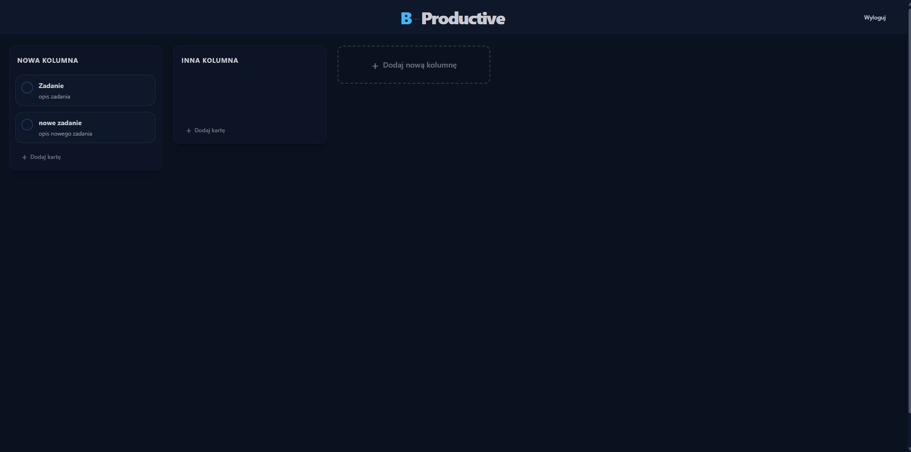
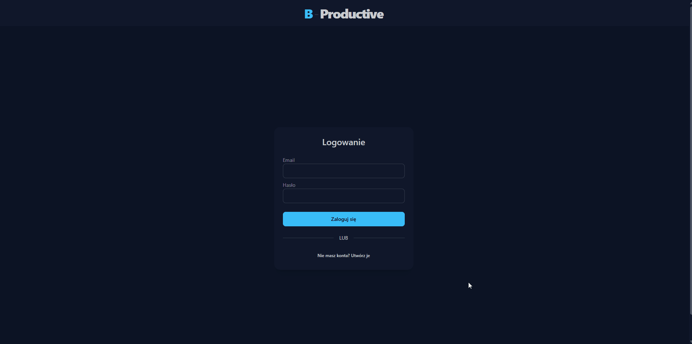

# 📊 B-Productive (Kanban Board)

My first **Full-Stack** project, connecting a server-side API with a client interface. A Kanban-style application designed for task organization and productivity enhancement.

Key project features:

- **Client-Server Architecture:** Complete separation of frontend and backend.
- **Full CRUD:** Create, read, update, and delete tasks and boards.
- **Database:** Persistent storage of user data, passwords, and task structures.

## ⚡ Interactive Dashboard

Full task lifecycle management without page reloads.



- **Creation:** Instantly add new cards to columns.
- **State Editing:** Intuitive task completion toggling via checkboxes, and easy renaming by clicking the pencil icon.
- **Deletion:** Permanently remove unwanted items from the database.

## 🔐 Authentication & Registration

Complete user flow demonstrating successful API communication and database integration.



## 🛠 Tech Stack

### Frontend (Client-Side)

- **React** (TypeScript + Vite) - modern SPA environment.
- **Tailwind CSS + daisyUI** - styling system and ready-to-use UI components.
- **Fetch API** - communication with the backend.
- **React Hot Toast** - notification system.

### Backend (Server-Side)

- **ASP.NET Core Web API** (.NET 8) - REST API returning JSON data.
- **Entity Framework Core** - ORM for database operations.
- **SQLite** - lightweight, file-based database.
- **LINQ** - data querying and manipulation.

### Architecture & Patterns

- **Client-Server** - total separation of frontend and backend layers.
- **REST API** - stateless communication architecture.
- **Dependency Injection (DI)** - built-in .NET IoC container.
- **DTO (Data Transfer Objects)** - secure data transfer between the API and the client.

### 🔜 Roadmap (To-Do)

- [ ] **JWT Authentication:** Implement secure login with JSON Web Tokens.
- [ ] **Drag & Drop:** Add drag-and-drop functionality for boards, columns, and tasks.

## 🚀 Getting Started

Prerequisites: **Node.js** and **.NET 8 SDK**.

1. **Clone the repository:**

   ```bash
   git clone https://github.com/X3raFin/B-Productive.git
   cd B-Productive
   ```

2. **Run the Backend**

   ```bash
   cd Serwer
   dotnet ef database update
   dotnet run
   ```

3. **Run the Frontend**
   ```bash
   cd Client
   npm install
   npm run dev
   ```

## 📬 Contact

Created by **Kacper Jankowski**.

- 🌐 **LinkedIn:** [LinkedIn](https://www.linkedin.com/in/kacper-jankowski-webdev/)
- 📧 **Email:** kacper.jankowski.webdev@gmail.com
- 💼 **Portfolio:** [Portfolio](https://portfolio-neon-one-lb87d8f29l.vercel.app/)
